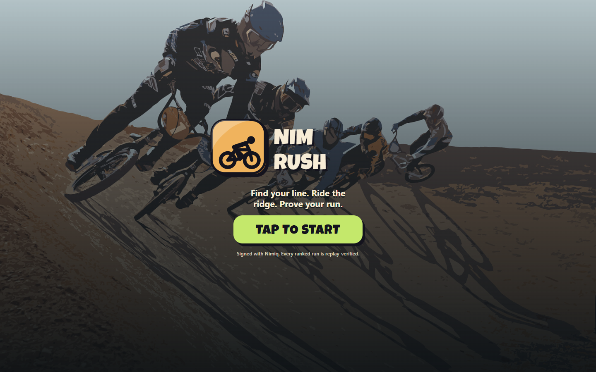
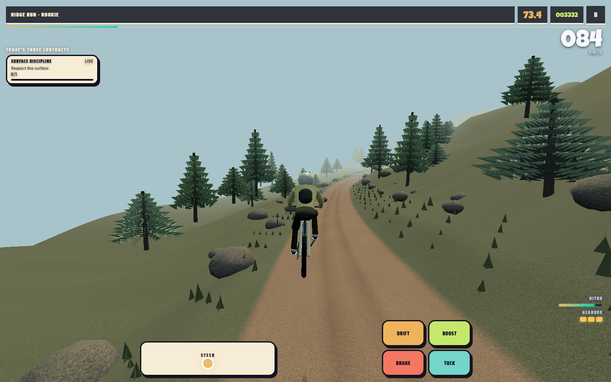
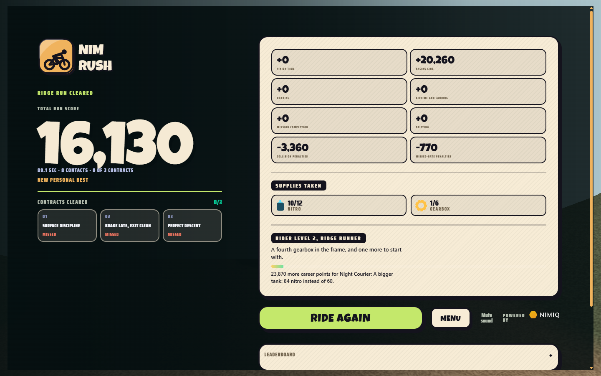

# NIM RUSH

[](https://github.com/Iziedking/sFace/actions/workflows/ci.yml)

NIM RUSH is a daily downhill race inside Nimiq Pay. One city, 1.9 km, 120
seconds, three attempts. Your wallet signs it, the server re-simulates it from your
input trace, and the day's top three split a funded Nimiq mainnet pool.

You get three goes at today's course and your best one stands, so the board
measures a descent rather than how many hours you had free.

Every verified run is recorded as a line. The next rider down the hill races
three of them as solid bikes, so the descent is traffic to get through rather
than an empty time trial.

[Play NIM RUSH](https://nim-rush.xyz/) · [Roadmap](docs/roadmap.md) · [Rules](docs/how-nim-rush-works.md) · [Nimiq Mini Apps](https://nimiq.dev/mini-apps/)

## The game

A run is one descent of a city course: about 1.9 km, 120 seconds, no laps and
no second chance inside it. The daily challenge gives you three of those
descents, and keeps the best. The bike does not hold its own speed, so the whole run
is a series of decisions about how much of it you can afford to carry.

The loop is:

1. Connect once with Nimiq. The signature proves who you are and moves nothing.
2. Pick a mode: a free run to practise, or today's challenge to take a rank.
3. Read the ridge ahead: the surface, the corner, the jump, the traffic.
4. Work the controls. Tuck for speed, sit up and brake for grip, spend a
   gearbox on a slide, spend nitro on a straight.
5. Collect what you need off the road. Nothing refills on its own.
6. Clear three contracts: one for your line, one for control, one for risk.
7. Read the ledger, find the one thing that cost you, and drop in again.

## Modes

**Free run.** Practise any city at Rookie or Pro rules. Contracts are live and
the ledger is the same. A free run never takes a place on the leaderboard, and
it is the only mode your rider level changes anything in.

**Daily challenge.** One course, one seed, the same for everybody, reset at
00:00 UTC. Free to enter. This is the run that ranks, and the run the day's
funded pool pays out on. Rules are fixed here: the Rookie/Pro chooser applies
to free runs and private lobbies only, because a ranked board on which riders
picked their own difficulty would not be a board.

Three attempts per wallet per day, and the best of them is the score that
stands. Unlimited runs made the daily a grind that measured patience rather
than a descent; exactly one made a beginner's first ever run their score for
the day. Three is the honest middle: learning the course is part of the day,
grinding it is not.

That is what lets the day settle on whoever turned up. The pool used to hold
until a second wallet posted, which charged the rider who showed up for the
absence of one who did not. Places nobody took are not paid out.

**Private lobbies.** Open a lobby, send the link, and the first seven riders
through the door are the field. First come, first served, free to enter. The
link is the invitation, so lobby ids are twenty-four random bytes. Followed
outside Nimiq Pay, the link explains itself and offers the app rather than
failing.

## Controls

| Action | Keyboard | Touch |
| --- | --- | --- |
| Steer | Left / Right arrows or A / D | Drag the steering pad |
| Tuck | Up arrow or W | Tuck |
| Brake | Down arrow or S | Brake |
| Drift | Shift | Drift |
| Boost | Space | Boost |
| Pause | P or Escape | Pause |

Each control costs something. Tuck adds about 16% to your speed and takes
roughly 38% of your steering authority. Brake trades speed for grip. Drift
spends a gearbox and buys a slide. Boost spends nitro.

Steering is not optional. A rider who holds the centre line and touches nothing
else does not finish: they stall against the traffic at around 895 m of 1,900,
whatever they do with the throttle. Pick a line through the obstacles and the
same course comes in around 71 seconds of the 120. The rest is not spare time,
it is score: the finish bonus pays 150 a second for every second you did not
need, which is the largest single thing a good descent earns.

Braking into a corner and tucking out of it is faster than holding one position
through both. That is the skill the course is built to reward.

## Supplies

Boost and drift are carried, not granted.

- **Nitro bottles** — twelve per city, roughly a second of boost each.
- **Gearboxes** — six per city, one slide each.

They sit in lanes rather than on the centre line, so the line you take decides
the fuel you finish with. A slide feeds the tank back, which turns a gearbox
into speed and makes control worth spending.

## The pack

The hill fills as the day does. Every verified run records the line it drew,
and the next rider's ticket pins three of them, so the first rider of a new
course has it to themselves and everybody after them has company. They ride as solid bikes: you can be
held up behind one, squeeze past on the inside, and put a shoulder in going
through.

You can put one out. Commit across the trail into a rival's flank, at speed,
with the bars turned into them, and they are down for the rest of your descent:
gone from the trail, gone from the gap list, gone from your place in the field,
and worth points. Drift into somebody at half pace and it is still just a
mistake, paid for as one.

That is computed from your input trace and the pinned pack, so the server
re-simulating your run agrees about who went down and when. A takedown is a
verified event, not something the browser asserts.

What it does not do is change their run. Theirs was ridden before yours existed
and their row on the board is already true, so you take them out of your
descent rather than out of their result. Both bikes live at once, where a
shoulder costs the other rider too, is on the roadmap.

Your place in the field is on screen for the whole descent. A rider whose
recording has run out finished ahead of you and keeps counting as ahead, so
you cannot climb the order by being slow.

## What is on screen

The trail is the thing you are reading, so the HUD stays off it.

- **Place in the field**, top left, for the whole run.
- **One contract at a time** — whichever is live, or the next one waiting. It
  fades a few seconds after anything last changed and comes straight back when
  progress moves. Three cards stacked over the trail were covering the part of
  the screen they were instructions about.
- **Speed, clock and score**, top right.
- **Nitro and gearboxes**, above your thumb, where spending them happens.

You name your rider once. After that the name is shown as settled with one way
to change it, rather than asking again on the way into every race. A name is one
per wallet per season, so if somebody already has the one you picked, the field
opens again and says so.

## Scoring

The finish screen shows the whole score rather than hiding it behind one
number:

- finish time
- racing-line quality
- braking and control
- airtime and landing quality
- mission completion
- drift and control
- collision penalties
- missed-gate penalties

Distance pays one point a metre, so reaching the bottom is a floor of about
1,900 rather than the score. The rest is finish time at 150 a second under the
limit, 900 a route gate held, 700 to 1,400 a contract, 1,500 a takedown, and
drift by angle and speed.

Contacts escalate: 300 for the first and 250 more for each after it, so one
mistake is cheap and flailing down the hill is not. A contact also drains
fifteen nitro and cuts your speed to a third, so it is paid for twice.

## Rider levels

Career score is the sum of your best run in each city, so the ladder is climbed
by riding better rather than by riding more. Levels widen the frame you work
in: a fourth gearbox, a bigger tank, longer slides, a wider reach for supplies.

Levels change free rides only. **Every ranked run is ridden on the same
equipment.** That is not a policy the client is trusted to keep: the server
rebuilds every ranked run from the city and the seed alone, so a client that
handed itself a bigger tank produces a trace the server disagrees with, and the
run is refused rather than ranked.

## Verified competition

Nimiq provides identity. The wallet signs who you are; it never signs a
payment, and entry is free.

The server issues a scoped ticket, pins the pack to it, and re-simulates the
submitted input trace against that same pack. The browser's score is a claim.
The verified replay is the result.

The daily pool pays the top three from a Nimiq mainnet treasury. A reward reads
as paid only once the transfer has been seen on chain, from the treasury to the
rider's wallet, at the right amount, deeply enough to trust. Until then it
reads as owed, sending, or held, and a held payout keeps its reason.

NIM RUSH has no gambling, no chance-based rewards, no entry fee, no fake
players, and no prize pool that is not funded.

## Screenshots

These snapshots come from the local PC browser capture flow and are checked in
so the public repository shows the actual game surface.

<p>
  
</p>
<p>
  
</p>
<p>
  
</p>

## Run locally

Requirements: Node.js 20.19 or newer.

```bash
npm ci
npm run dev
```

Open the local address printed by Vite. The game starts in practice mode and
does not require a wallet.

Release checks:

```bash
npm run check
npm run build
```

To capture fresh PC snapshots after a visual change, run the local server and
use the browser probe with its public capture flag:

```bash
node scripts/probe-rush-browser.mjs --origin=http://127.0.0.1:5173 --public-screenshots
```

## Atlas adventure reference

The earlier NIM Atlas adventure is still in the build and still reachable at
[/?atlas=legacy](/?atlas=legacy). It is kept as a reference for the payment
evidence flow - ask, permission, current network record - which NIM RUSH
reuses for its verified runs. It is not the default game and is not ranked.

## Contributing

Read [CONTRIBUTING.md](CONTRIBUTING.md) before opening a pull request. Every
gameplay change should explain the player-facing rule, add a focused test, and
include the verification command used.

## License

MIT. See [LICENSE](LICENSE).
